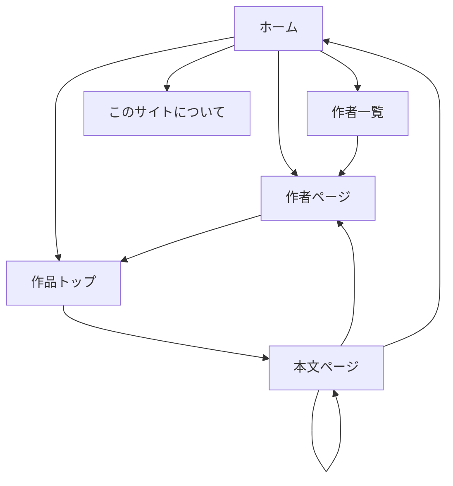

# UI.md
WorldClassicsJP UI設計メモ（ASCII Wireframe / Ponchi-e）

最終更新日: 2026-03-07

---

## 1. 目的

この文書は WorldClassicsJP の画面設計を、実装前にテキストベースで共有・レビューできるようにするための UI 設計書である。

目的は以下。

- Claude Code / Codex CLI が画面構造を誤解しないようにする
- 実装前にトップページ、作品ページ、作者ページ、長編連載ページの見え方を確認する
- スマホUIを優先して設計する
- 広告枠、画像、ナビゲーションを配置レベルで明示する

この文書の記法は、ASCIIワイヤーフレームと簡易ポンチ絵を併用する。

---

## 2. 全体設計方針

### 2.1 基本方針

- モバイルファースト
- UI文言は日本語優先（固有名詞・作品原題のみ必要に応じて原語併記）
- 文字が主役
- 1カラム中心
- 長文読書に耐える
- 前へ / 次へ / 目次 / 作者ページ を常にわかりやすく置く
- 広告は入れるが、読書体験を壊さない
- 画像はあるときだけ表示し、無いときは自然に消える

### 2.2 デザインコンセプト（追加）

より洗練され、所有欲を満たす読書体験を提供するため、以下のデザインコンセプトを導入する。

- **タイポグラフィ**:
  - **本文**: 長時間読んでも疲れにくい、可読性の高い明朝体（例: `Noto Serif JP`）を採用する。
  - **見出し/UI**: モダンでクリーンな印象のゴシック体（例: `Noto Sans JP`）を組み合わせ、古典と現代の融合を図る。

- **配色**:
  - **ライトモード**: 背景は純白でなくクリーム色 (`#FAF9F6` 等)、文字は純黒でなくチャコールグレー (`#333333` 等) を基本とし、目に優しいコントラストを保つ。
  - **ダークモード**: ライトモードと対になる、目に優しいダークモードを標準機能として提供する。
  - **アクセント**: リンクやボタンには、彩度を抑えた深みのある色（ディープブルーやバーガンディ等）を使用し、全体を引き締める。

- **余白**:
  - セクション間や段落間の余白を十分に確保し、窮屈さを感じさせない、ゆったりとした贅沢なレイアウトを目指す。

### 2.3 主要ページ

- ホーム
- 作者一覧ページ
- 作者ページ
- 作品トップページ
- 本文ページ
- このサイトについて / 方針

### 2.4 共通UI部品

- ヘッダー
- フッター
- 広告枠
- 作者カード
- 作品カード
- ナビゲーションブロック
- 進捗ブロック
- 画像ブロック

---

## 3. サイトマップ（Mermaid）



---

## 4. ホームページ

### 4.1 役割

- その日の新着を見せる
- サイトのコンセプトを一瞬で伝える
- 作者一覧・最新作品一覧へ誘導する
- 長編連載中作品を目立たせる

### 4.2 PCイメージ

```text
+----------------------------------------------------------------------------------+
| WorldClassicsJP                                                                  |
| 世界文学を日本語で読む。パブリックドメイン名作を日本語で楽しむ。                  |
| [ホーム] [作者一覧] [作品一覧] [このサイトについて]                                                 |
+----------------------------------------------------------------------------------+

+----------------------------------------------------------------------------------+
| 広告枠（上部）                                                            |
+----------------------------------------------------------------------------------+

+----------------------------------------------------------------------------------+
| 本日の新着                                                                  |
| タイトル: The Celebrated Jumping Frog                                             |
| 著者: Mark Twain / マーク・トウェイン                                            |
| サマリー: ユーモアたっぷりの短編。                                               |
| [今すぐ読む] [作者ページ]                                                        |
+----------------------------------------------------------------------------------+

+--------------------------------------+  +----------------------------------------+
| 連載中                       |  | 最近の更新                         |
| Tom Sawyer                           |  | 1. Jumping Frog                        |
| 第4部 / 18                          |  | 2. Tom Sawyer 第4部                   |
| [続きを読む]                          |  | 3. H.G. Wells 短編                     |
+--------------------------------------+  +----------------------------------------+

+----------------------------------------------------------------------------------+
| 注目作者                                                                  |
| [Mark Twain] [H.G. Wells] [Oscar Wilde] [Jules Verne] [もっと見る]                 |
+----------------------------------------------------------------------------------+

+----------------------------------------------------------------------------------+
| このサイトについて                                                                   |
| パブリックドメイン文学をAIで日本語翻訳して公開する実験サイト。                   |
| [詳しく見る]                                                                      |
+----------------------------------------------------------------------------------+

+----------------------------------------------------------------------------------+
| 広告枠（下部）                                                                 |
+----------------------------------------------------------------------------------+

+----------------------------------------------------------------------------------+
| フッター: RSS | サイトマップ | GitHub | 方針                                          |
+----------------------------------------------------------------------------------+
```

### 4.3 スマホイメージ

```text
+--------------------------------------+
| WorldClassicsJP                      |
| 世界文学を日本語で読む               |
| [メニュー]                               |
+--------------------------------------+

+--------------------------------------+
| 広告枠                             |
+--------------------------------------+

+--------------------------------------+
| 本日の新着                      |
| Jumping Frog                         |
| Mark Twain                           |
| ユーモア短編                         |
| [今すぐ読む]                         |
+--------------------------------------+

+--------------------------------------+
| 連載中                       |
| Tom Sawyer                           |
| 第4部 / 18                          |
| [続きを読む]                          |
+--------------------------------------+

+--------------------------------------+
| 注目作者                     |
| Mark Twain                           |
| H.G. Wells                           |
| Oscar Wilde                          |
| [作者一覧へ]                         |
+--------------------------------------+

+--------------------------------------+
| フッター                               |
+--------------------------------------+
```

### 4.4 ホーム 必須要素

- サイトタイトル
- サイト説明
- 今日の新着
- 連載中作品
- 注目作者
- 広告枠
- フッター導線

---

## 5. 作者一覧ページ

### 5.1 役割

- 作者一覧のハブ
- 作者名から作品に入る
- SEO流入口になる

### 5.2 イメージ

```text
+----------------------------------------------------------------------------------+
| 作者一覧                              |
| 作者別一覧                                                                        |
+----------------------------------------------------------------------------------+

+----------------------------------------------------------------------------------+
| [作者を検索]                                                                   |
+----------------------------------------------------------------------------------+

+---------------------------+  +---------------------------+  +--------------------+
| Mark Twain                |  | H.G. Wells                |  | Oscar Wilde        |
| 作品数: 12                |  | 作品数: 9                 |  | 作品数: 5          |
| [作者ページ]              |  | [作者ページ]              |  | [作者ページ]       |
+---------------------------+  +---------------------------+  +--------------------+

+----------------------------------------------------------------------------------+
| 広告枠                             |
+----------------------------------------------------------------------------------+
```

### 5.3 スマホイメージ

```text
+--------------------------------------+
| 作者一覧                              |
+--------------------------------------+

+--------------------------------------+
| [検索]                             |
+--------------------------------------+

+--------------------------------------+
| Mark Twain                           |
| 作品数: 12                           |
| [作者ページ]                         |
+--------------------------------------+

+--------------------------------------+
| H.G. Wells                           |
| 作品数: 9                            |
| [作者ページ]                         |
+--------------------------------------+

+--------------------------------------+
| 広告枠                             |
+--------------------------------------+
```

---

## 6. 作者ページ

### 6.1 役割

- 作者紹介
- 作者の作品一覧
- 長編進行状況の表示
- ポートレート表示

### 6.2 PCイメージ

```text
+----------------------------------------------------------------------------------+
| Mark Twain / マーク・トウェイン                                                  |
+----------------------------------------------------------------------------------+

+---------------------------+  +--------------------------------------------------+
| [肖像画像]          |  | 生没年: 1835 - 1910                               |
|                           |  | 19世紀アメリカを代表する作家。                    |
|                           |  | ユーモアと風刺で知られる。                       |
+---------------------------+  +--------------------------------------------------+

+----------------------------------------------------------------------------------+
| 広告枠                             |
+----------------------------------------------------------------------------------+

+----------------------------------------------------------------------------------+
| 作品一覧                                |
| 1. The Celebrated Jumping Frog        [読む]                                      |
| 2. Tom Sawyer                         [作品トップ]                                |
|    連載状況: 第4部 / 18                                                           |
| 3. Extract from Captain Stormfield    [読む]                                      |
+----------------------------------------------------------------------------------+
```

### 6.3 スマхоイメージ

```text
+--------------------------------------+
| Mark Twain                           |
| マーク・トウェイン                   |
+--------------------------------------+

+--------------------------------------+
| [肖像画像]                     |
+--------------------------------------+

+--------------------------------------+
| 生没年: 1835 - 1910                  |
| 19世紀アメリカの作家                 |
+--------------------------------------+

+--------------------------------------+
| 作品一覧                                |
| Jumping Frog [読む]                  |
| Tom Sawyer [作品トップ]              |
| 第4部 / 18                          |
+--------------------------------------+
```

### 6.4 作者ページ 必須要素

- 作者名（原語 / 日本語）
- 生没年
- 短い説明
- ポートレート
- 作品一覧
- 連載進行状況
- 広告枠

---

## 7. 作品トップページ

### 7.1 役割

- 長編の目次ページ
- 作品全体の説明
- 各パートへの導線
- 短編ならそのまま本文へ導線

### 7.2 イメージ

```text
+----------------------------------------------------------------------------------+
| Tom Sawyer                                                                        |
| トム・ソーヤーの冒険                                                             |
+----------------------------------------------------------------------------------+

+----------------------------------------------------------------------------------+
| 著者: Mark Twain / マーク・トウェイン                                           |
| 出典: Project Gutenberg                                                         |
| 状態: 連載中                                                               |
| 公開済み: 4 / 18                                                                     |
+----------------------------------------------------------------------------------+

+----------------------------------------------------------------------------------+
| 概要                                                                            |
| 少年トム・ソーヤーの冒険を描く代表作。                                            |
+----------------------------------------------------------------------------------+

+----------------------------------------------------------------------------------+
| 広告枠                             |
+----------------------------------------------------------------------------------+

+----------------------------------------------------------------------------------+
| 目次                                                                            |
| 第1部  [読む]                                                                    |
| 第2部  [読む]                                                                    |
| 第3部  [読む]                                                                    |
| 第4部  [読む]                                                                    |
| ...                                                                               |
+----------------------------------------------------------------------------------+

+----------------------------------------------------------------------------------+
| [作者ページへ] [次のパートへ]                                                     |
+----------------------------------------------------------------------------------+
```

### 7.3 作品トップページ 必須要素

- タイトル（原語 / 日本語）
- 著者
- 出典
- 進行状況
- 概要
- 目次
- 作者ページへの導線
- 広告枠

---

## 8. 本文ページ

### 8.1 役割

- 実際に読むページ
- 最も重要なUI
- 長文読書に最適化する

### 8.2 PCイメージ

```text
+----------------------------------------------------------------------------------+
| Tom Sawyer                                                                        |
| 第4部 / 18                                                                       |
| Mark Twain                                                                        |
+----------------------------------------------------------------------------------+

+----------------------------------------------------------------------------------+
| [前へ] [目次] [作者ページ] [次へ]                                                |
+----------------------------------------------------------------------------------+

+----------------------------------------------------------------------------------+
| 広告枠（上部）                                                                    |
+----------------------------------------------------------------------------------+

+----------------------------------------------------------------------------------+
| 本文本文本文本文本文本文本文本文本文本文本文本文本文本文本文本文本文本文        |
| 本文本文本文本文本文本文本文本文本文本文本文本文本文本文本文本文本文本文        |
|                                                                                  |
| [挿絵（ある場合）]                                                                 |
|                                                                                  |
| 本文本文本文本文本文本文本文本文本文本文本文本文本文本文本文本文本文本文        |
| 本文本文本文本文本文本文本文本文本文本文本文本文本文本文本文本文本文本文        |
+----------------------------------------------------------------------------------+

+----------------------------------------------------------------------------------+
| 広告枠（本文中）                                                                   |
+----------------------------------------------------------------------------------+

+----------------------------------------------------------------------------------+
| 本文本文本文本文本文本文本文本文本文本文本文本文本文本文本文本文本文本文        |
| 本文本文本文本文本文本文本文本文本文本文本文本文本文本文本文本文本文本文        |
+----------------------------------------------------------------------------------+

+----------------------------------------------------------------------------------+
| 翻訳注記: この翻訳は自動生成であり、誤りを含む場合があります。            |
+----------------------------------------------------------------------------------+

+----------------------------------------------------------------------------------+
| [前へ] [目次] [作者ページ] [次へ]                                                |
+----------------------------------------------------------------------------------+

+----------------------------------------------------------------------------------+
| 広告枠（下部）                                                                 |
+----------------------------------------------------------------------------------+
```

### 8.3 スマホイメージ

```text
+--------------------------------------+
| Tom Sawyer                           |
| 第4部 / 18                          |
| Mark Twain                           |
+--------------------------------------+

+--------------------------------------+
| [前へ] [目次] [次へ]                 |
| [作者]                               |
+--------------------------------------+

+--------------------------------------+
| 広告枠                             |
+--------------------------------------+

+--------------------------------------+
| 本文本文本文本文本文本文本文本文     |
| 本文本文本文本文本文本文本文本文     |
|                                      |
| [挿絵]                               |
|                                      |
| 本文本文本文本文本文本文本文本文     |
+--------------------------------------+

+--------------------------------------+
| 広告枠                             |
+--------------------------------------+

+--------------------------------------+
| 自動翻訳のため誤りを含む場合あり     |
+--------------------------------------+

+--------------------------------------+
| [前へ] [目次] [次へ]                 |
+--------------------------------------+
```

### 8.4 本文ページ 必須要素

- 読書進捗バー（画面上部）
- タイトル
- パート番号
- 著者
- 本文
- 挿絵（あれば）
- 翻訳注意書き
- 前 / 次 / 目次 / 作者ページ
- 広告枠

### 8.5 本文UIルール

- 1行は長すぎない
- スマホでは横スクロール禁止
- 段落間隔は広め
- 注釈は本文を邪魔しない
- 広告は文中を分断しすぎない

---

## 9. このサイトについて / 方針 ページ

### 9.1 内容

- このサイトについて
- パブリックドメイン方針
- AI翻訳であること
- 免責事項
- GitHub / 問い合わせ導線

### 9.2 イメージ

```text
+----------------------------------------------------------------------------------+
| このサイトについて                                                                   |
+----------------------------------------------------------------------------------+

+----------------------------------------------------------------------------------+
| WorldClassicsJP は、パブリックドメイン文学をAIで日本語翻訳して公開する           |
| 実験サイトです。                                                                  |
+----------------------------------------------------------------------------------+

+----------------------------------------------------------------------------------+
| 方針                                                                            |
| - パブリックドメイン作品のみ                                                              |
| - AI翻訳である旨の明示                                                       |
| - 翻訳精度を保証しない                                                |
+----------------------------------------------------------------------------------+
```

---

## 10. ナビゲーション方針

### 10.1 共通導線

- ホーム
- 作者一覧
- このサイトについて

### 10.2 読書導線

- 前へ
- 次へ
- 目次
- 作者ページ

### 10.3 迷子防止

各本文ページに最低2回、次のどれかを置く。

- 作品目次への戻り
- 作者ページへの移動
- ホームへの移動

---

## 11. 広告枠ポリシー

### 11.1 配置方針

- 上部広告
- 本文中広告
- 下部広告

### 11.2 表示ルール

- すべてのページに配置
- レイアウトレベルで共通適用
- 本文の途中に置く場合は段落の切れ目に限定

### 11.3 ASCIIイメージ

```text
[ヘッダー]
[広告枠]
[タイトル]
[本文]
[広告枠]
[本文]
[フッターナビ]
[広告枠]
```

---

## 12. 画像ポリシー

### 12.1 種類

- 作者ポートレート
- 原作挿絵
- 装飾的パブリックドメイン画像

### 12.2 表示ルール

- 無い場合は非表示
- スマホでは幅100%
- 本文の途中に入れる場合は段落境界でのみ挿入
- 読書を邪魔しない
- 表示領域に入った際にフワッと表示されるよう遅延読み込み（Lazy Loading）を適用する
- クリックで画像を拡大表示するライトボックス機能を実装する

---

## 13. スマホ優先ルール

- 1カラム
- 大きめフォント
- ボタンはタップしやすい大きさ
- 画像は幅100%
- メニューは簡潔
- 余白を削りすぎない

---

## 14. 実装者向けメモ

この UI.md は、Claude Code / Codex CLI に渡して HTML / CSS / Jekyll template を作らせるための前段資料として使う。

AIへの指示では、以下の順で渡すとよい。

1. SPEC.md
2. usecase.md
3. UI.md

この順にすると、仕様 → 処理 → 画面 の順で理解しやすい。

---

## 15. CDN利用方針（リッチUI実装）

このプロジェクトのモックUIでは、開発速度と表現力を優先し、CDNで配信されるフロントエンドライブラリを利用してよい。

### 15.1 採用する主なCDN（推奨）

- Tailwind CSS CDN  
  目的: レイアウト・余白・レスポンシブ実装を高速化する
- GSAP + ScrollTrigger CDN  
  目的: セクション出現アニメーション、スクロール連動演出
- Lenis CDN  
  目的: 滑らかなスクロール体験
- Google Fonts CDN  
  目的: 日本語本文・見出しの印象を高める

### 15.2 実装ルール

- UI文言は日本語優先とし、英語は固有名詞・作品原題に限定する
- CDNスクリプトは `head` または `body` 末尾で、依存順に読み込む
- アニメーションは「読書を邪魔しない」強度に抑える
- 本文ページでは可読性を最優先し、過度な動きは入れない
- モバイル回線を考慮し、CDN数は必要最小限にする
- **ページ遷移**: ページ間を移動する際は、コンテンツがフワッと切り替わるクロスフェード演出を加え、体験の連続性を高める。
- **スクロール演出**: GSAP + ScrollTrigger を活用し、ホームページ等で各セクションが画面に入った際に、下からフワッと浮かび上がるような上品な登場アニメーションを実装する。
- **マイクロインタラクション**: ボタンやリンクへのホバー時に、わずかに浮き上がる・色が滑らかに変わる等の小さなフィードバックを加え、UIの質感を向上させる。

### 15.3 バージョン固定

- 互換性事故を避けるため、主要ライブラリは可能な限りバージョン付きURLを使う
- 例: `gsap@3.12.x` のように固定する

### 15.4 フォールバック方針

- CDNが失敗しても本文表示と基本ナビゲーションは機能させる
- アニメーションライブラリが読めない場合は、静的表示に自動フォールバックする
- クリティカル機能（本文、目次、前へ/次へ）は CDN 非依存で動作する構成を維持する

### 15.5 本番運用メモ

- 本番化時は、必要に応じて self-host への切替を検討する
- ただし v1 では「まず読めること」を優先し、CDN利用を許容する

---

## 16. 今後追加したいUI

- 作者検索のサジェスト
- お気に入り作者導線
- 関連作品表示
- 作者タイムライン
- 同時代作家リンク
- 読了位置保存（将来）

---

## 17. 最小実装優先順位

### フェーズ1 必須

- ホーム
- 作者一覧ページ
- 作者ページ
- 作品トップページ
- 本文ページ
- スマホ対応
- 広告枠
- 基本ナビ
- ダークモード

### フェーズ2

- 検索
- 関連作品
- 作者タイムライン
- 装飾強化

---

## 18. ひとことで言うと

WorldClassicsJP の UI は、「文学を読むこと」を最優先にした、静かで見やすい1カラム中心の読書UIである。
