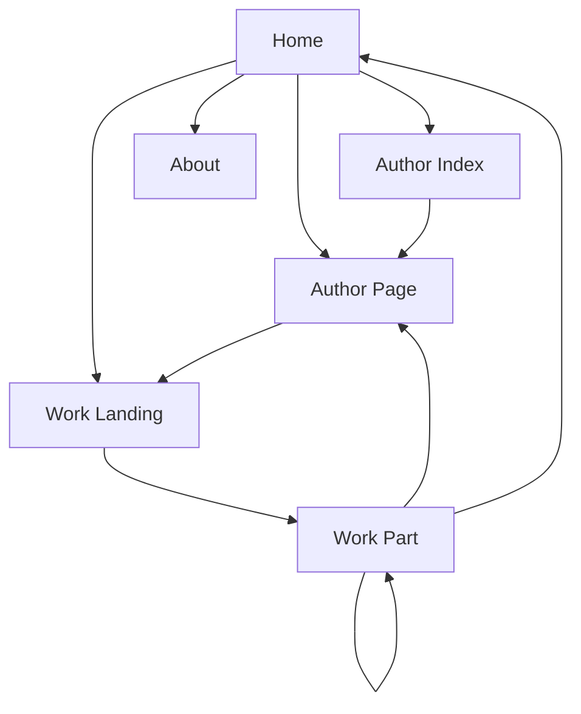

# UI.md
WorldClassicsJP UI設計メモ（ASCII Wireframe / Ponchi-e）

最終更新日: 2026-03-06

---

## 1. 目的

この文書は WorldClassicsJP の画面設計を、実装前にテキストベースで共有・レビューできるようにするための UI 設計書である。

目的は以下。

- Claude Code / Codex CLI が画面構造を誤解しないようにする
- 実装前にトップページ、作品ページ、作者ページ、長編連載ページの見え方を確認する
- スマホUIを優先して設計する
- 広告枠、画像、ナビゲーションを配置レベルで明示する

この文書の記法は、ASCIIワイヤーフレームと簡易ポンチ絵を併用する。

---

## 2. 全体設計方針

### 2.1 基本方針

- mobile first
- 文字が主役
- 1カラム中心
- 長文読書に耐える
- 前へ / 次へ / 目次 / 作者ページ を常にわかりやすく置く
- 広告は入れるが、読書体験を壊さない
- 画像はあるときだけ表示し、無いときは自然に消える

### 2.2 主要ページ

- Home
- Author Index
- Author Page
- Work Landing Page
- Work Part Page
- About / Policy

### 2.3 共通UI部品

- Header
- Footer
- Ad block
- Author card
- Work card
- Navigation block
- Progress block
- Image block

---

## 3. サイトマップ（Mermaid）



---

## 4. Home ページ

### 4.1 役割

- その日の新着を見せる
- サイトのコンセプトを一瞬で伝える
- 作者一覧・最新作品一覧へ誘導する
- 長編連載中作品を目立たせる

### 4.2 PCイメージ

```text
+----------------------------------------------------------------------------------+
| WorldClassicsJP                                                                  |
| 世界文学を日本語で読む。Public Domain Classics in Japanese.                      |
| [Home] [Authors] [Works] [About]                                                 |
+----------------------------------------------------------------------------------+

+----------------------------------------------------------------------------------+
| AD BLOCK (Top Banner)                                                            |
+----------------------------------------------------------------------------------+

+----------------------------------------------------------------------------------+
| TODAY'S RELEASE                                                                  |
| タイトル: The Celebrated Jumping Frog                                             |
| 著者: Mark Twain / マーク・トウェイン                                            |
| サマリー: ユーモアたっぷりの短編。                                               |
| [今すぐ読む] [作者ページ]                                                        |
+----------------------------------------------------------------------------------+

+--------------------------------------+  +----------------------------------------+
| SERIALIZED NOW                       |  | RECENT UPDATES                         |
| Tom Sawyer                           |  | 1. Jumping Frog                        |
| Part 4 / 18                          |  | 2. Tom Sawyer Part 4                   |
| [続きを読む]                          |  | 3. H.G. Wells 短編                     |
+--------------------------------------+  +----------------------------------------+

+----------------------------------------------------------------------------------+
| FEATURED AUTHORS                                                                  |
| [Mark Twain] [H.G. Wells] [Oscar Wilde] [Jules Verne] [More]                    |
+----------------------------------------------------------------------------------+

+----------------------------------------------------------------------------------+
| ABOUT THIS SITE                                                                   |
| パブリックドメイン文学をAIで日本語翻訳して公開する実験サイト。                   |
| [詳しく見る]                                                                      |
+----------------------------------------------------------------------------------+

+----------------------------------------------------------------------------------+
| AD BLOCK (Bottom)                                                                 |
+----------------------------------------------------------------------------------+

+----------------------------------------------------------------------------------+
| Footer: RSS | Sitemap | GitHub | Policy                                          |
+----------------------------------------------------------------------------------+
```

### 4.3 スマホイメージ

```text
+--------------------------------------+
| WorldClassicsJP                      |
| 世界文学を日本語で読む               |
| [Menu]                               |
+--------------------------------------+

+--------------------------------------+
| AD BLOCK                             |
+--------------------------------------+

+--------------------------------------+
| TODAY'S RELEASE                      |
| Jumping Frog                         |
| Mark Twain                           |
| ユーモア短編                         |
| [今すぐ読む]                         |
+--------------------------------------+

+--------------------------------------+
| SERIALIZED NOW                       |
| Tom Sawyer                           |
| Part 4 / 18                          |
| [続きを読む]                          |
+--------------------------------------+

+--------------------------------------+
| FEATURED AUTHORS                     |
| Mark Twain                           |
| H.G. Wells                           |
| Oscar Wilde                          |
| [作者一覧へ]                         |
+--------------------------------------+

+--------------------------------------+
| Footer                               |
+--------------------------------------+
```

### 4.4 Home 必須要素

- サイトタイトル
- サイト説明
- 今日の新着
- 連載中作品
- 注目作者
- 広告枠
- フッター導線

---

## 5. Author Index ページ

### 5.1 役割

- 作者一覧のハブ
- 作者名から作品に入る
- SEO流入口になる

### 5.2 イメージ

```text
+----------------------------------------------------------------------------------+
| AUTHORS                                                                           |
| 作者別一覧                                                                        |
+----------------------------------------------------------------------------------+

+----------------------------------------------------------------------------------+
| [Search Author]                                                                   |
+----------------------------------------------------------------------------------+

+---------------------------+  +---------------------------+  +--------------------+
| Mark Twain                |  | H.G. Wells                |  | Oscar Wilde        |
| 作品数: 12                |  | 作品数: 9                 |  | 作品数: 5          |
| [作者ページ]              |  | [作者ページ]              |  | [作者ページ]       |
+---------------------------+  +---------------------------+  +--------------------+

+----------------------------------------------------------------------------------+
| AD BLOCK                                                                          |
+----------------------------------------------------------------------------------+
```

### 5.3 スマホイメージ

```text
+--------------------------------------+
| AUTHORS                              |
+--------------------------------------+

+--------------------------------------+
| [Search]                             |
+--------------------------------------+

+--------------------------------------+
| Mark Twain                           |
| 作品数: 12                           |
| [作者ページ]                         |
+--------------------------------------+

+--------------------------------------+
| H.G. Wells                           |
| 作品数: 9                            |
| [作者ページ]                         |
+--------------------------------------+

+--------------------------------------+
| AD BLOCK                             |
+--------------------------------------+
```

---

## 6. Author Page

### 6.1 役割

- 作者紹介
- 作者の作品一覧
- 長編進行状況の表示
- ポートレート表示

### 6.2 PCイメージ

```text
+----------------------------------------------------------------------------------+
| Mark Twain / マーク・トウェイン                                                  |
+----------------------------------------------------------------------------------+

+---------------------------+  +--------------------------------------------------+
| [Portrait Image]          |  | 生没年: 1835 - 1910                               |
|                           |  | 19世紀アメリカを代表する作家。                    |
|                           |  | ユーモアと風刺で知られる。                       |
+---------------------------+  +--------------------------------------------------+

+----------------------------------------------------------------------------------+
| AD BLOCK                                                                          |
+----------------------------------------------------------------------------------+

+----------------------------------------------------------------------------------+
| WORKS                                                                             |
| 1. The Celebrated Jumping Frog        [読む]                                      |
| 2. Tom Sawyer                         [作品トップ]                                |
|    連載状況: Part 4 / 18                                                           |
| 3. Extract from Captain Stormfield    [読む]                                      |
+----------------------------------------------------------------------------------+
```

### 6.3 スマホイメージ

```text
+--------------------------------------+
| Mark Twain                           |
| マーク・トウェイン                   |
+--------------------------------------+

+--------------------------------------+
| [Portrait Image]                     |
+--------------------------------------+

+--------------------------------------+
| 生没年: 1835 - 1910                  |
| 19世紀アメリカの作家                 |
+--------------------------------------+

+--------------------------------------+
| WORKS                                |
| Jumping Frog [読む]                  |
| Tom Sawyer [作品トップ]              |
| Part 4 / 18                          |
+--------------------------------------+
```

### 6.4 Author Page 必須要素

- 作者名（原語 / 日本語）
- 生没年
- 短い説明
- ポートレート
- 作品一覧
- 連載進行状況
- 広告枠

---

## 7. Work Landing Page（作品トップ）

### 7.1 役割

- 長編の目次ページ
- 作品全体の説明
- 各パートへの導線
- 短編ならそのまま本文へ導線

### 7.2 イメージ

```text
+----------------------------------------------------------------------------------+
| Tom Sawyer                                                                        |
| トム・ソーヤーの冒険                                                             |
+----------------------------------------------------------------------------------+

+----------------------------------------------------------------------------------+
| Author: Mark Twain / マーク・トウェイン                                           |
| Source: Project Gutenberg                                                         |
| Status: In Progress                                                               |
| Parts: 4 / 18                                                                     |
+----------------------------------------------------------------------------------+

+----------------------------------------------------------------------------------+
| SUMMARY                                                                           |
| 少年トム・ソーヤーの冒険を描く代表作。                                            |
+----------------------------------------------------------------------------------+

+----------------------------------------------------------------------------------+
| AD BLOCK                                                                          |
+----------------------------------------------------------------------------------+

+----------------------------------------------------------------------------------+
| TABLE OF CONTENTS                                                                 |
| Part 1  [読む]                                                                    |
| Part 2  [読む]                                                                    |
| Part 3  [読む]                                                                    |
| Part 4  [読む]                                                                    |
| ...                                                                               |
+----------------------------------------------------------------------------------+

+----------------------------------------------------------------------------------+
| [作者ページへ] [次のパートへ]                                                     |
+----------------------------------------------------------------------------------+
```

### 7.3 Work Landing Page 必須要素

- タイトル（原語 / 日本語）
- 著者
- 出典
- 進行状況
- 概要
- 目次
- 作者ページへの導線
- 広告枠

---

## 8. Work Part Page（本文ページ）

### 8.1 役割

- 実際に読むページ
- 最も重要なUI
- 長文読書に最適化する

### 8.2 PCイメージ

```text
+----------------------------------------------------------------------------------+
| Tom Sawyer                                                                        |
| Part 4 / 18                                                                       |
| Mark Twain                                                                        |
+----------------------------------------------------------------------------------+

+----------------------------------------------------------------------------------+
| [前へ] [目次] [作者ページ] [次へ]                                                |
+----------------------------------------------------------------------------------+

+----------------------------------------------------------------------------------+
| AD BLOCK (Top)                                                                    |
+----------------------------------------------------------------------------------+

+----------------------------------------------------------------------------------+
| 本文本文本文本文本文本文本文本文本文本文本文本文本文本文本文本文本文本文        |
| 本文本文本文本文本文本文本文本文本文本文本文本文本文本文本文本文本文本文        |
|                                                                                  |
| [Illustration if exists]                                                          |
|                                                                                  |
| 本文本文本文本文本文本文本文本文本文本文本文本文本文本文本文本文本文本文        |
| 本文本文本文本文本文本文本文本文本文本文本文本文本文本文本文本文本文本文        |
+----------------------------------------------------------------------------------+

+----------------------------------------------------------------------------------+
| AD BLOCK (Mid)                                                                    |
+----------------------------------------------------------------------------------+

+----------------------------------------------------------------------------------+
| 本文本文本文本文本文本文本文本文本文本文本文本文本文本文本文本文本文本文        |
| 本文本文本文本文本文本文本文本文本文本文本文本文本文本文本文本文本文本文        |
+----------------------------------------------------------------------------------+

+----------------------------------------------------------------------------------+
| Translation Note: この翻訳は自動生成であり、誤りを含む場合があります。            |
+----------------------------------------------------------------------------------+

+----------------------------------------------------------------------------------+
| [前へ] [目次] [作者ページ] [次へ]                                                |
+----------------------------------------------------------------------------------+

+----------------------------------------------------------------------------------+
| AD BLOCK (Bottom)                                                                 |
+----------------------------------------------------------------------------------+
```

### 8.3 スマホイメージ

```text
+--------------------------------------+
| Tom Sawyer                           |
| Part 4 / 18                          |
| Mark Twain                           |
+--------------------------------------+

+--------------------------------------+
| [前へ] [目次] [次へ]                 |
| [作者]                               |
+--------------------------------------+

+--------------------------------------+
| AD BLOCK                             |
+--------------------------------------+

+--------------------------------------+
| 本文本文本文本文本文本文本文本文     |
| 本文本文本文本文本文本文本文本文     |
|                                      |
| [挿絵]                               |
|                                      |
| 本文本文本文本文本文本文本文本文     |
+--------------------------------------+

+--------------------------------------+
| AD BLOCK                             |
+--------------------------------------+

+--------------------------------------+
| 自動翻訳のため誤りを含む場合あり     |
+--------------------------------------+

+--------------------------------------+
| [前へ] [目次] [次へ]                 |
+--------------------------------------+
```

### 8.4 Work Part Page 必須要素

- タイトル
- パート番号
- 著者
- 本文
- 挿絵（あれば）
- 翻訳注意書き
- 前 / 次 / 目次 / 作者ページ
- 広告枠

### 8.5 本文UIルール

- 1行は長すぎない
- スマホでは横スクロール禁止
- 段落間隔は広め
- 注釈は本文を邪魔しない
- 広告は文中を分断しすぎない

---

## 9. About / Policy ページ

### 9.1 内容

- このサイトについて
- パブリックドメイン方針
- AI翻訳であること
- 免責事項
- GitHub / 問い合わせ導線

### 9.2 イメージ

```text
+----------------------------------------------------------------------------------+
| ABOUT THIS SITE                                                                   |
+----------------------------------------------------------------------------------+

+----------------------------------------------------------------------------------+
| WorldClassicsJP は、パブリックドメイン文学をAIで日本語翻訳して公開する           |
| 実験サイトです。                                                                  |
+----------------------------------------------------------------------------------+

+----------------------------------------------------------------------------------+
| POLICY                                                                            |
| - public domain only                                                              |
| - AI translation disclaimer                                                       |
| - no guarantee of perfect accuracy                                                |
+----------------------------------------------------------------------------------+
```

---

## 10. ナビゲーション方針

### 10.1 共通導線

- Home
- Authors
- About

### 10.2 読書導線

- 前へ
- 次へ
- 目次
- 作者ページ

### 10.3 迷子防止

各本文ページに最低2回、次のどれかを置く。

- 作品目次への戻り
- 作者ページへの移動
- ホームへの移動

---

## 11. 広告枠ポリシー

### 11.1 配置方針

- Top Banner
- Mid Article
- Bottom

### 11.2 表示ルール

- すべてのページに配置
- layout レベルで強制
- 本文の途中に置く場合は段落の切れ目に限定

### 11.3 ASCIIイメージ

```text
[HEADER]
[AD]
[TITLE]
[BODY]
[AD]
[BODY]
[FOOTER NAV]
[AD]
```

---

## 12. 画像ポリシー

### 12.1 種類

- 作者ポートレート
- 原作挿絵
- 装飾的パブリックドメイン画像

### 12.2 表示ルール

- 無い場合は非表示
- スマホでは幅100%
- 本文の途中に入れる場合は段落境界でのみ挿入
- 読書を邪魔しない

---

## 13. スマホ優先ルール

- 1カラム
- 大きめフォント
- ボタンはタップしやすい大きさ
- 画像は幅100%
- メニューは簡潔
- 余白を削りすぎない

---

## 14. 実装者向けメモ

この UI.md は、Claude Code / Codex CLI に渡して HTML / CSS / Jekyll template を作らせるための前段資料として使う。

AIへの指示では、以下の順で渡すとよい。

1. SPEC.md
2. USECASE.md
3. UI.md

この順にすると、仕様 → 処理 → 画面 の順で理解しやすい。

---

## 15. 今後追加したいUI

- 作者検索のサジェスト
- ダークモード
- お気に入り作者導線
- 関連作品表示
- 作者タイムライン
- 同時代作家リンク
- 読了位置保存（将来）

---

## 16. 最小実装優先順位

### Phase 1 必須

- Home
- Author Index
- Author Page
- Work Landing Page
- Work Part Page
- スマホ対応
- 広告枠
- 基本ナビ

### Phase 2

- 検索
- 関連作品
- 作者タイムライン
- 装飾強化

---

## 17. ひとことで言うと

WorldClassicsJP の UI は、「文学を読むこと」を最優先にした、静かで見やすい1カラム中心の読書UIである。
