# class.md
WorldClassicsJP クラス図

バージョン: 1.0.0
最終更新日: 2026-03-07
対応 SPEC: v1.5.1
対応 sequence: v1.0.1

---

## 概要

本書は [sequence.md](./sequence.md) および [SPEC.md](./SPEC.md) をもとに、
主要コンポーネントとデータモデルを Mermaid クラス図として表現したものである。

---

## クラス図

```mermaid
classDiagram
    %% =====================================================
    %% データモデル（JSON / YAML ファイルとして永続化）
    %% =====================================================

    class WorksMaster {
        <<datamodel>>
        +int work_id
        +str work_slug
        +str title
        +str title_ja
        +str author_name
        +str author_name_ja
        +str author_slug
        +str source_url
        +SourceType source_type
        +int death_year
        +bool pd_verified
        +LengthClass length_class
    }

    class State {
        <<datamodel>>
        +int next_work_id
        +int current_work_id
        +int current_part
        +str current_segment_id
        +Stage current_stage
        +WorkStatus current_work_status
        +str last_processed_date
        +str last_run_id
        +int translate_retry_count
        +int consecutive_fail_days
        +int publish_retry_count
        +str pre_publish_head
        +load()$ State
        +save(tmpPath) void
        +initDefault(minWorkId)$ State
    }

    class StateLock {
        <<datamodel>>
        +str run_id
        +int pid
        +str started_at
        +str heartbeat_at
        +acquire()$ bool
        +heartbeat() void
        +release() void
        +isStale() bool
    }

    class Config {
        <<datamodel>>
        +str host
        +int port
        +str model
        +int daily_max_chars
        +int current_phase
        +load()$ Config
    }

    class RunLog {
        <<datamodel>>
        +str run_id
        +str date
        +str stage
        +str status
        +list~str~ errors
        +append(entry) void
        +save() void
    }

    class ImageMeta {
        <<datamodel>>
        +str source_page_url
        +str file_url
        +str author
        +RightsLabel rights_label
        +int year
        +str rights_verified_at
    }

    %% =====================================================
    %% 処理コンポーネント（パイプライン各ステージ）
    %% =====================================================

    class Pipeline {
        <<component>>
        +str run_id
        -State state
        -Config config
        -StateLock lock
        +run() void
        -acquireLock() bool
        -releaseLock() void
        -loadState() State
        -saveState() void
        -runPreprocess() list~Segment~
        -runTranslate(seg) TranslationResult
        -runQualityCheck(res) QAResult
        -runPublish(res) bool
        -loadNext() void
    }

    class Preprocessor {
        <<component>>
        +str model
        +splitSegments(rawText, maxChars) list~Segment~
        +cleanText(rawText) str
        +generateMetadata(text) dict
    }

    class Translator {
        <<component>>
        +str model
        +translate(expandedPrompt) TranslationResult
    }

    class QualityChecker {
        <<component>>
        +str model
        +check(original, translated) QAResult
    }

    class Publisher {
        <<component>>
        +str tmpBuildDir
        +buildIndexPage(works) void
        +buildWorkPage(work) void
        +buildPartPage(work, part, result) void
        +buildAuthorPage(author) void
        +generateRSS(works) void
        +generateSitemap(works) void
        +reflectToProduction() void
        +recordPrePublishHead() str
        +commitAndPush() bool
        +rollback(prePublishHead) void
        +cleanup() void
    }

    class ImageJob {
        <<component>>
        +detectChanges(hashFilePath) bool
        +searchImage(name) list~str~
        +verifyRights(filePageUrl) RightsLabel
        +download(fileUrl) bytes
        +save(imagePath, meta) void
        +updateHash(hashFilePath) void
    }

    %% =====================================================
    %% 値オブジェクト（処理結果の一時データ構造）
    %% =====================================================

    class Segment {
        <<value>>
        +str segment_id
        +int part_number
        +str text
        +int char_count
    }

    class TranslationResult {
        <<value>>
        +str translated_text
        +str summary
        +list~str~ keywords
    }

    class QAResult {
        <<value>>
        +str status
        +float score
        +list~str~ issues
    }

    %% =====================================================
    %% 列挙型（フィールドの許容値）
    %% =====================================================

    class Stage {
        <<enumeration>>
        idle
        preprocess
        translate
        quality_check
        publish
    }

    class WorkStatus {
        <<enumeration>>
        active
        paused
        complete
        exhausted
        failed
    }

    class LengthClass {
        <<enumeration>>
        short
        medium
        long
    }

    class SourceType {
        <<enumeration>>
        txt
        text_url
    }

    class RightsLabel {
        <<enumeration>>
        Public domain
        CC0
        Public Domain Mark
    }

    %% =====================================================
    %% 関連
    %% =====================================================

    %% Pipeline — データモデル
    Pipeline --> State        : reads / writes
    Pipeline --> StateLock    : manages
    Pipeline --> Config       : reads
    Pipeline ..> WorksMaster  : reads via current_work_id
    Pipeline ..> RunLog       : creates

    %% Pipeline — 処理コンポーネント呼び出し
    Pipeline ..> Preprocessor   : calls
    Pipeline ..> Translator      : calls
    Pipeline ..> QualityChecker  : calls
    Pipeline ..> Publisher       : calls

    %% 各コンポーネントの入出力
    Preprocessor ..> Segment          : produces
    Translator   ..> TranslationResult : returns
    QualityChecker ..> QAResult        : returns
    Publisher    ..> TranslationResult : consumes

    %% State — 列挙型
    State --> Stage      : current_stage
    State --> WorkStatus : current_work_status

    %% State — WorksMaster 参照
    State ..> WorksMaster : current_work_id / next_work_id

    %% WorksMaster — 列挙型
    WorksMaster --> LengthClass : length_class
    WorksMaster --> SourceType  : source_type

    %% 画像補助ジョブ
    ImageJob ..> WorksMaster : reads（hash比較で差分検出）
    ImageJob ..> ImageMeta   : creates
    ImageMeta --> RightsLabel : rights_label
```

---

## ファイルパス対応

| クラス | 永続化パス |
|-------|-----------|
| `WorksMaster` | `/data/works_master.json` |
| `State` | `/data/state.json`（書き込みは `state.json.tmp` 経由でアトミック） |
| `StateLock` | `/data/state.lock` |
| `Config` | `/config.yaml` |
| `RunLog` | `/logs/YYYY/MM/DD/{run_id}.json` |
| `ImageMeta` | `/assets/images/authors/<author-slug>.yaml` または `/assets/images/illustrations/<image-file>.yaml`（画像ファイルと同名の sidecar） |
| *(hash ファイル)* | `/data/works_master.hash`（`ImageJob` が管理） |
| *(ビルド作業域)* | `/tmp_build/`（`Publisher` が使用、公開後に削除） |

---

## 凡例

| 記法 | 意味 |
|------|------|
| `<<datamodel>>` | JSON / YAML ファイルとして永続化されるデータ構造 |
| `<<component>>` | パイプラインの各ステージを担う処理モジュール |
| `<<value>>` | メソッド呼び出しの戻り値として一時的に扱うデータ構造 |
| `<<enumeration>>` | フィールドの許容値定義 |
| `-->` | 関連（永続的な参照・保持） |
| `..>` | 依存（呼び出し時のみ利用する一時的な関係） |
| `$` メソッド修飾子 | static / class method（インスタンス不要で呼び出し可能） |
