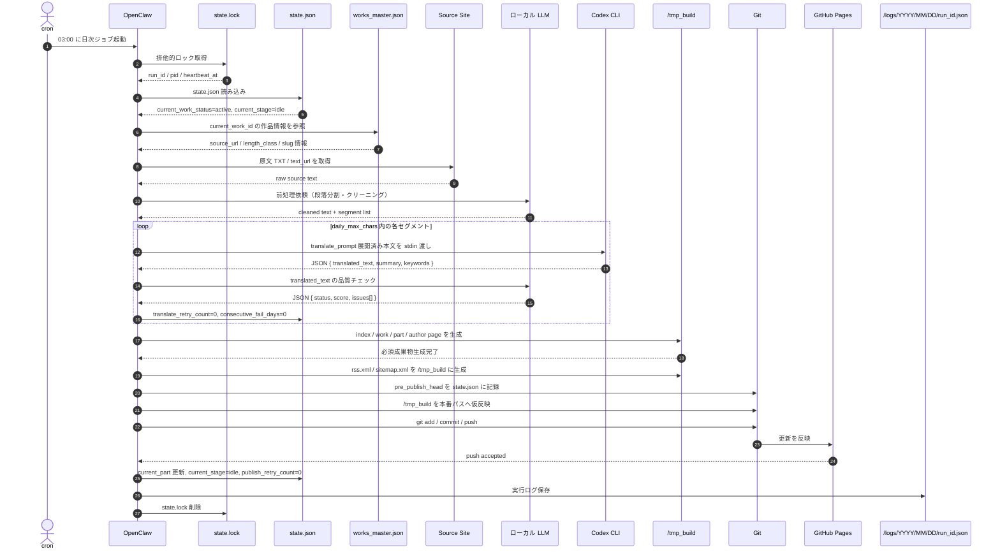
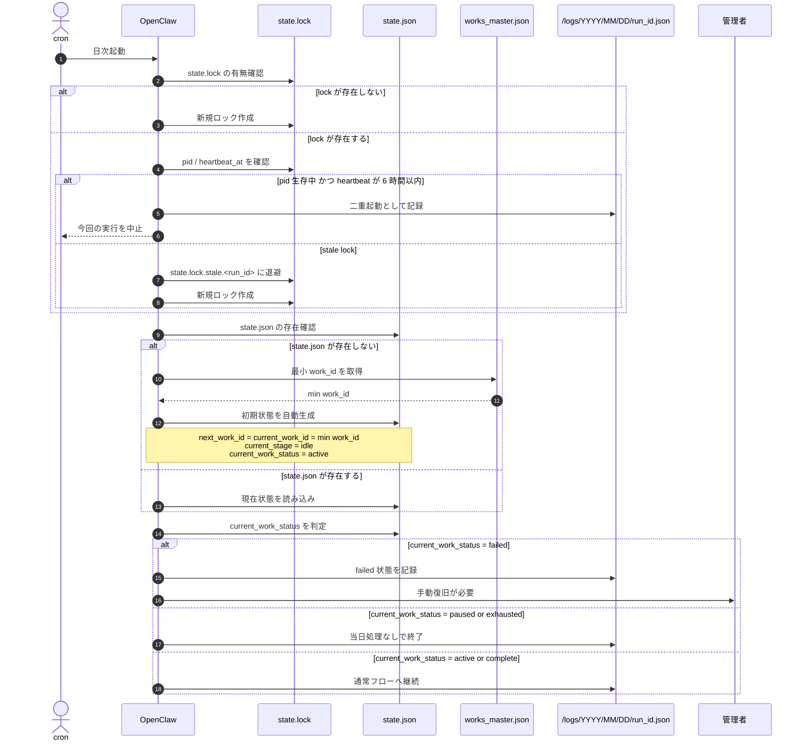
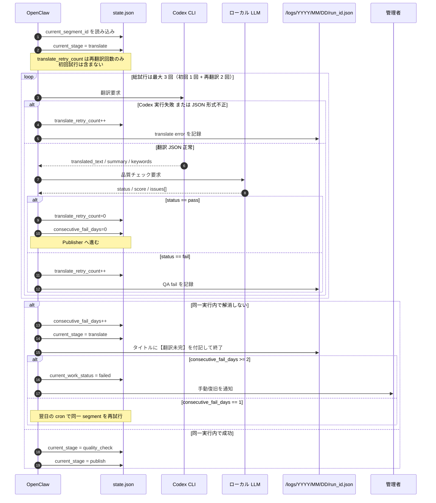
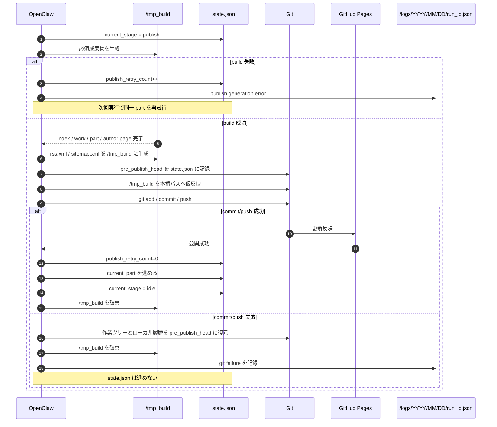
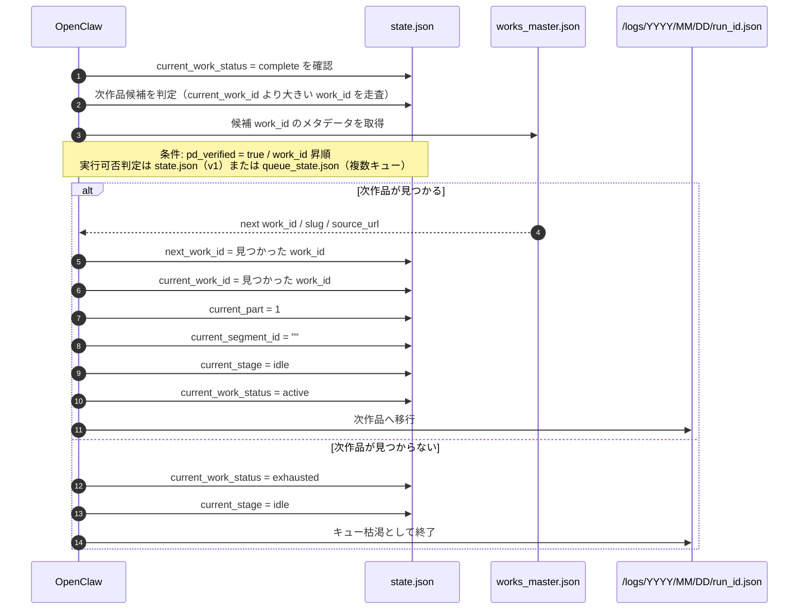
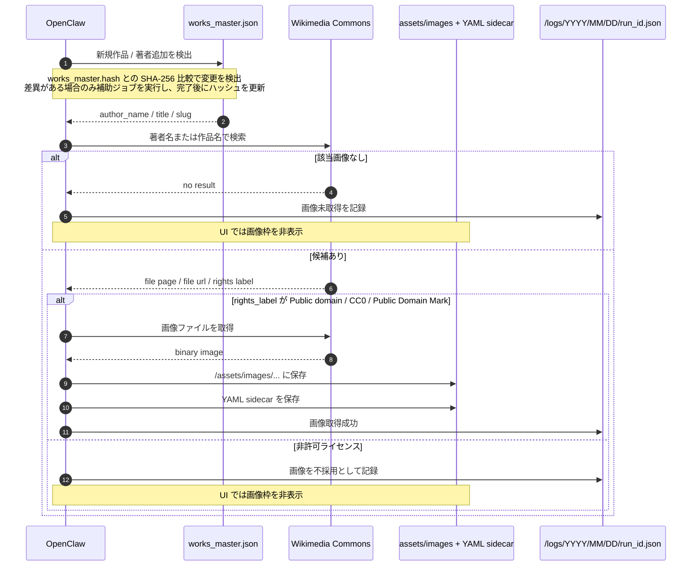

# sequence.md
WorldClassicsJP シーケンス設計

バージョン: 1.0.1
最終更新日: 2026-03-07
対応 SPEC: v1.5.1
対応 UseCase: v1.2.0

---

## 1. 目的

本書は、[SPEC.md](./SPEC.md) と [usecase.md](./usecase.md) をもとに、主要処理を Mermaid のシーケンス図として具体化したものである。

- 日次パイプライン正常系
- ロック復旧・初期化
- 翻訳と品質チェックの再試行
- 公開とロールバック
- 次作品移行と exhausted 遷移
- 画像取得の補助ジョブ

---

## 2. SQ-01 日次パイプライン正常系

---

## 3. SQ-02 ロック復旧・初期化

---

## 4. SQ-03 翻訳・品質チェック・翌日再挑戦

---

## 5. SQ-04 公開・Git 反映・ロールバック

---

## 6. SQ-05 次作品移行・exhausted 遷移

---

## 7. SQ-06 画像取得補助ジョブ

> このシーケンスは日次翻訳パイプラインとは分離した補助ジョブを表す。

---

## 8. メモ

- `state.lock`、`/tmp_build`、`pre_publish_head` は論理的な参与者として表現している。
- `pre_publish_head` は `state.json` の `pre_publish_head` フィールドに 40 桁 SHA として保存する。
- `rss.xml` と `sitemap.xml` は補助成果物であり、必須 HTML 成果物の `/tmp_build` への生成後・本番パスへの仮反映前に `/tmp_build` 内に生成する。仮反映で HTML 成果物と一緒にコピーされる。
- 本書作成時点では、シーケンス図化のために追加の Q&A は不要だった。
