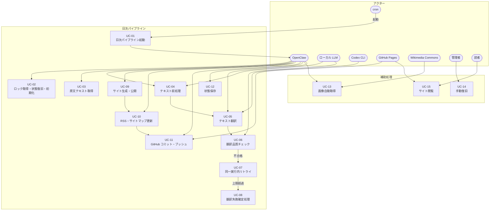
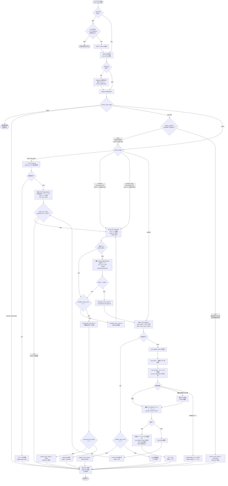
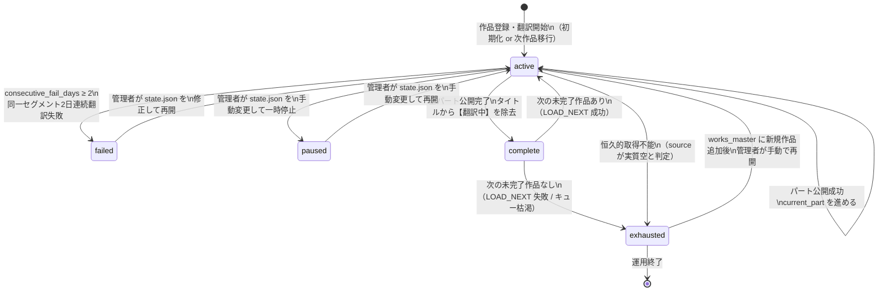
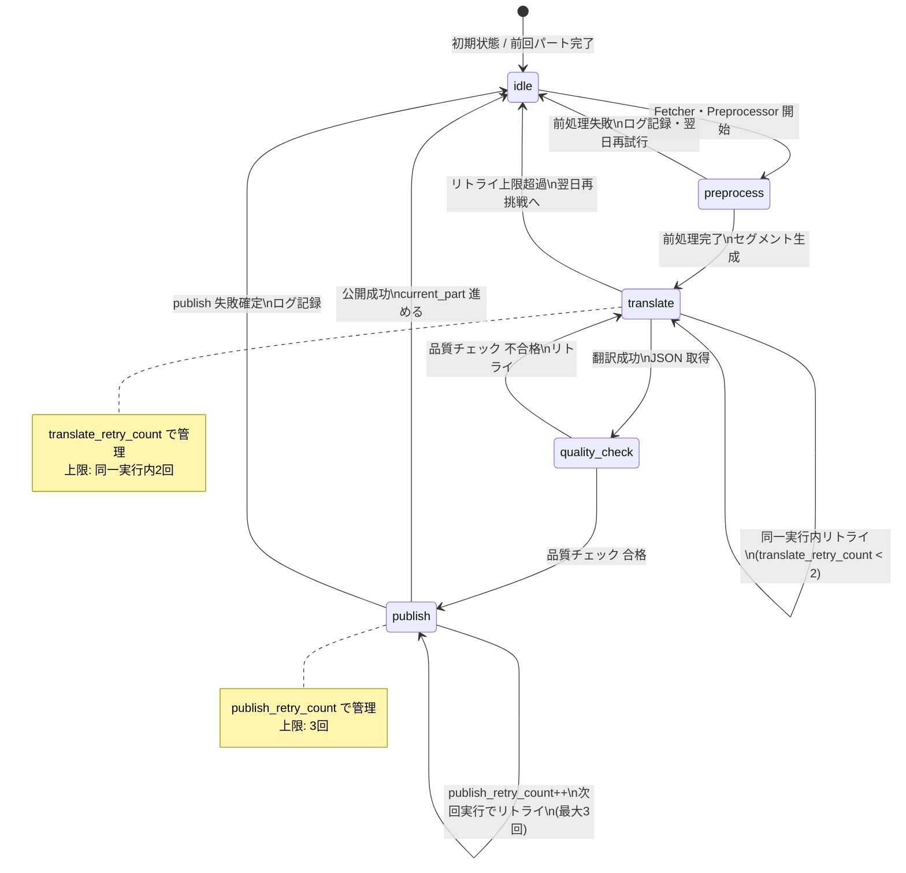

# usecase.md
WorldClassicsJP ユースケース設計

バージョン: 1.2.0
最終更新日: 2026-03-06
対応 SPEC: v1.5.0

---

## 1. アクター定義

| アクター | 種別 | 説明 |
|---------|------|------|
| **cron** | システム | OpenClaw 内蔵スケジューラ。毎日 03:00 にパイプラインをトリガーする |
| **OpenClaw** | 自律 AI エージェント | Win11 WSL2 上で動作するオーケストレーター。全 UC の主アクター |
| **ローカル LLM** | AI システム | Ollama 等。前処理・品質チェックに使用。無制限・無料 |
| **Codex CLI** | AI システム | GPT-5.4 モデル。翻訳専用。定額プランのトークン上限あり |
| **GitHub** | 外部サービス | リポジトリホスティング・GitHub Pages でのサイト公開 |
| **Wikimedia Commons** | 外部サービス | 著者ポートレート・イラストの取得元 |
| **管理者** | 人間 | `failed` 発生時にのみ手動介入する |
| **読者** | 人間 | 公開されたサイトを閲覧する |

---

## 2. ユースケース一覧

| UC番号 | ユースケース名 | 主アクター | 概要 |
|--------|--------------|-----------|------|
| UC-01 | 日次パイプライン起動 | cron | 毎日 03:00 に OpenClaw を起動し、パイプラインを開始する |
| UC-02 | ロック取得・状態復旧・初期化 | OpenClaw | 二重起動を防ぎ、`state.json` が無ければ初期生成し、前回中断状態から再開する |
| UC-03 | 原文テキスト取得 | OpenClaw | works_master.json に基づき source_url から原文を取得する |
| UC-04 | テキスト前処理 | ローカル LLM | 段落分割・クリーニング・メタデータ生成を行い、セグメントを生成する |
| UC-05 | テキスト翻訳 | Codex CLI | セグメントを日本語に翻訳し、JSON で結果を返す |
| UC-06 | 翻訳品質チェック | ローカル LLM | 翻訳結果の自然さ・正確さ・表記ゆれを検証する |
| UC-07 | 同一実行内リトライ | OpenClaw | 翻訳失敗・品質不合格時に最大2回再翻訳する |
| UC-08 | 翻訳失敗確定処理 | OpenClaw | 2日連続失敗で `failed` に設定し処理を停止する |
| UC-09 | サイト生成・公開 | OpenClaw | 翻訳結果から HTML を生成し、tmp_build 経由で公開する |
| UC-10 | RSS・サイトマップ更新 | OpenClaw | 公開完了後に rss.xml・sitemap.xml を自動生成・更新する |
| UC-11 | GitHub コミット・プッシュ | OpenClaw | 生成した成果物を GitHub にコミット・プッシュし、GitHub Pages に反映する |
| UC-12 | 状態保存（state.json） | OpenClaw | 各ステージ完了時に state.json をアトミック書き込みで更新する |
| UC-13 | 画像自動取得 | OpenClaw | Wikimedia Commons から著者ポートレート・イラストを取得・検証・保存する |
| UC-14 | 手動復旧 | 管理者 | `failed` 状態の作品を確認し、state.json を修正して再開する |
| UC-15 | サイト閲覧 | 読者 | 公開された作品・著者ページを閲覧する |

---

## 3. ユースケース全体関係図



---

## 4. 日次パイプライン 詳細フロー



---

## 5. 翻訳・リトライ シーケンス図

```mermaid
sequenceDiagram
    autonumber
    participant OC as OpenClaw
    participant LLLM as ローカル LLM
    participant CODEX as Codex CLI
    participant STATE as state.json

    OC->>STATE: current_segment_id・stage 読み込み
    OC->>LLLM: セグメントテキスト送信（前処理）
    LLLM-->>OC: 段落分割・クリーニング済みテキスト

    Note over OC,STATE: translate_retry_count は再翻訳回数のみを表す<br/>初回試行は含まない

    loop 総試行は最大3回（初回1回 + 再翻訳2回）
        OC->>OC: translate_prompt.md テンプレート展開
        OC->>CODEX: 展開済みプロンプト（stdin）
        CODEX-->>OC: JSON { translated_text, summary, keywords }

        alt JSON 形式不正 or 実行失敗
            OC->>STATE: translate_retry_count++, stage=translate
            OC->>OC: リトライ待機
        else JSON 正常
            OC->>LLLM: 原文 + 翻訳文 送信（品質チェック）
            LLLM-->>OC: JSON { status, score, issues[] }

            alt status == fail
                OC->>STATE: translate_retry_count++
                OC->>OC: リトライ
            else status == pass
                OC->>STATE: translate_retry_count=0, consecutive_fail_days=0
                OC->>OC: Publisher へ進む
                break
            end
        end
    end

    alt 同一実行内で解消しない（translate_retry_count == 2）
        OC->>STATE: consecutive_fail_days++, stage=translate
        OC->>OC: 【翻訳未完】をタイトルに付記

        alt consecutive_fail_days >= 2
            OC->>STATE: current_work_status = failed
            OC->>OC: 処理停止・管理者通知
        else consecutive_fail_days == 1
            OC->>OC: 翌日の cron 実行で再挑戦
        end
    end
```

---

## 6. 作品ステータス 状態遷移図



---

## 7. 実行ステージ 状態遷移図（current_stage）



---

## 8. 画像自動取得フロー（UC-13）

> **注意**: UC-13 は日次翻訳パイプライン（UC-01〜UC-12）とは**分離した補助ジョブ**として実行する。
> 実行タイミング：`works_master.json` への新規作品・著者追加時、または手動トリガー時。
> 画像が未取得でも翻訳公開は妨げられない（未取得の場合は画像枠を非表示）。

```mermaid
flowchart TD
    START([補助ジョブ起動\nworks_master 更新検出\nまたは手動トリガー]) --> SEARCH

    SEARCH["AI エージェント\nWikimedia Commons 検索\n著者名 or 作品名でクエリ"]
    SEARCH --> FOUND{ファイルページ\n発見？}

    FOUND -->|NO| SKIP([画像枠を非表示\n処理終了])

    FOUND -->|YES| CHECK_LICENSE{権利表示確認\nPublic domain ?\nCC0 ?\nPublic Domain Mark ?}

    CHECK_LICENSE -->|該当なし\nCC BY / fair use 等| SKIP

    CHECK_LICENSE -->|合格| DOWNLOAD[ファイル URL から\nダウンロード]

    DOWNLOAD --> SAVE_IMG[/assets/images/authors/ または\n/assets/images/illustrations/ に保存]
    SAVE_IMG --> SAVE_META[YAML sidecar 生成\nsource_page_url / file_url\nauthor / rights_label / year\nrights_verified_at]

    SAVE_META --> DONE([画像取得完了])
```

---

## 9. ユースケース別 前提条件・成功条件一覧

| UC番号 | 前提条件 | 成功条件 | 例外・代替フロー |
|--------|---------|---------|----------------|
| UC-01 | cron が設定済み | OpenClaw プロセスが起動する | cron 自体の障害は運用者が対処 |
| UC-02 | `/data/works_master.json` が存在する | ロック取得成功・state.json 読み込みまたは初期生成完了 | stale lock の場合は退避後取得。`state.json` 欠如時は最小 `work_id` で初期化 |
| UC-03 | state.json で current_work_status=active かつ works_master.json に current_work_id が存在し pd_verified=true | テキストデータを取得しローカルに保存 | 取得失敗時はログ記録し翌日再試行 |
| UC-04 | 原文テキスト取得済み | daily_max_chars 以内のセグメント列を生成 | 前処理失敗時はログ記録し翌日再試行 |
| UC-05 | セグメント生成済み | JSON `{ translated_text, summary, keywords }` を正常取得 | 失敗時は同一実行内最大2回リトライ |
| UC-06 | 翻訳 JSON 取得済み | `status == pass` を返す | 不合格時は UC-07 へ |
| UC-07 | translate_retry_count < 2 | 再翻訳で品質合格 | 上限到達時は consecutive_fail_days++ |
| UC-08 | consecutive_fail_days >= 2 | `current_work_status` を `failed` に設定し停止 | 管理者が UC-14 で手動復旧 |
| UC-09 | **新規実行時**: 品質チェック合格済み / **publish 再開時**: 前回翻訳済みセグメントが存在し `current_stage = publish` | /tmp_build に必須成果物を全生成 | 失敗時は tmp_build 破棄・最大3回リトライ |
| UC-10 | Publisher 成功 | rss.xml / sitemap.xml 更新完了 | 補助成果物のみ失敗ならログ記録して継続。致命的エラー時は publish failure としてリトライ |
| UC-11 | `pre_publish_head` 記録済み・本番パスへの仮反映完了 | git push 成功・GitHub Pages 更新 | 失敗時は `pre_publish_head` に復元し翌日リトライ |
| UC-12 | 各ステージ完了 | state.json アトミック書き込み成功 | 書き込み失敗時はパイプライン停止 |
| UC-13 | `works_master.json` に新規作品・著者が追加済み（日次翻訳パイプラインとは独立した補助ジョブ） | PD/CC0/PDM の画像を保存し YAML sidecar 生成 | 該当画像なしの場合は画像枠を非表示。ジョブ失敗は翻訳公開に影響しない |
| UC-14 | current_work_status == failed | state.json を修正し active に戻す | 管理者による手動操作 |
| UC-15 | GitHub Pages にページが公開済み | 読者がブラウザでページを閲覧できる | - |
